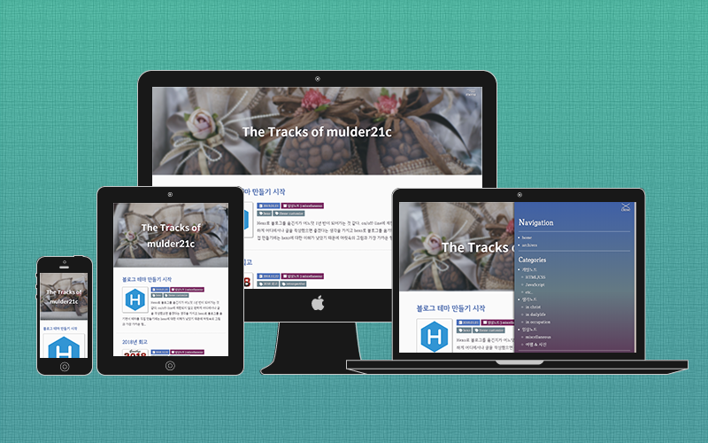

# hexo-theme-amorfati

## Language

[Korean](./documents/ko)

## Demo

You can refer to [my blog](https://mulder21c.github.io) or [demo site](http://mulder21c.github.io/hexo-theme-amorfati)



## Support Browsers

- modern browsers
- IE 10+

## Feature

- Responsive design
- Web accessibility
- Subtitle
- SEO friendly
  + support JSONLD
  + support link relation types
    - `<link rel="cannonical" ...>`
    - `<link rel="archives ...>`
    - `<link rel="first ...>`
    - `<link rel="prev ...>`
    - `<link rel="next ...>`
  + support post-specific open graph data and JSONLD data
  + support setting to verify website ownership
    - google
    - bing
    - naver
- Post-specific additional style
- Comment
  - LiveRe (Korean Service)
  - Disqus
- 360° photo/video
    via Google VR
- Webfont Loader
- Author's SNS links
- External links
- Analytics


## Installation

First, clone this repository

```bash
$ cd your/hexo/directory
$ git clone -b master --single-branch --depth=1 https://github.com/mulder21c/hexo-theme-amorfati.git themes/amorfati
```

Then, install dependencies

> This process include installing web fonts required for theme and inserting font and CSS files into
> theme's directory. Refer to `copy-resource.js` file.

```bash
$ cd themes/amorfati
$ npm install
```

**note**: When you update from version 1.0.4 or lower you should remove
`hexo-server-jade`. It was deprecated, so that I replaced that renderer to `hexo-server-pug`

## Configuration

See the [_config.yml.example](./_config.yml.example)

### Hero

Images set in Hero are exposed at the top of the home, list layout pages (like archive). <br>
You can set hero to either object or url string.

```yaml
hero:
  url:
  width:
  height:
  size:
  position:

```
- `url`: image url you want to use as hero
- `width`: width dimension
- `height`: height dimension
- `size`: a string that corresponds to the value of background-size.
- `position`: a string that corresponds to the value of background-position.

If you set the dimensions of the image, these values can be used in JSONLD.

Or

```yaml
hero:

```
`hero`: in this case, image url you want to use as hero

#### Example

```yaml
hero:
  url: /upload/hero.jpg
  width: 980
  height: 550

```
```yaml
hero:
  url: /upload/hero.jpg
  width: 980
  height: 550
  position: center top

```

### Profile

```yaml
profile:
  gravatar:
  social:
    github:
    facebook:
    linkedin:
    instagram:
    twitter:
    flickr:
    rss:

```

- `gravatar`: If you set the value of this item, it will be exposed as author on the post page.
- `social`: If you set each item, SNS link is exposed at the bottom of the sidebar navigation.

#### Example

```yaml
profile:
  gravatar: /upload/gravatar.png
  social:
    github: https://github.com/mulder21c
    facebook: https://www.facebook.com/mulder21c
    linkedin:
    instagram:
    twitter:
    flickr:
    rss:

```

### Site Verification Ownership

```yaml
site_verification:
  enable:
  google:
  naver:
  bing:

```

- `enable`: Whether or not to use site verification. <br>
  if set to `false`, then it does not apply even if each item has a value.
- `google`: your google verification string
- `naver`: your naver verification string
- `bing`: your bing verification string


### Analytics

```yaml
analytics:
  google:
  naver:

```

- `google`: your GA_TRACKING_ID
- `naver`: your na_account_id

### Webfonts

```yaml
webfonts:
  uses:
  extraFonts:

```

- `uses`: An array of font names to use
- `extraFronts`: An array of objects consisting of the name and URL of a font other than the default font

#### Examples

- use default fonts

  ```yaml
  webfonts:
    uses: ['Noto Sans Kr', 'Font Awesome']
    extraFonts:

  ```

- use other than the default fonts

  ```yaml
  webfonts:
    uses: ['Lato', 'Font Awesome']
    extraFonts:
      - famliy: 'Lato'
        url: 'https://fonts.googleapis.com/css?family=Lato'

  ```

  **Note**: Since the default font for the theme is `Noto Sans KR`, so if you want to use a different
  font as the default font, you need to change the font name in the
  `source/css/partials/_typography.scss` file.

### External Link

```yaml
  links:

```

- `links`: An array of objects consisting of names and URLs to be exposed

If set this item, the external links section within the sidebar navigation is exposed.

#### Examples

```yaml
  links:
    - name: Ask
      url: https://ask.fm/myask
```

### Comments

```yaml
liveRe:
  uid:

disqus:
  shortname:

```

Set the comment platform you want to use.

## Front matter

You can see the whole configs in [post.md](./post.md).

### Subtitle

```yaml
title:
subtitle:

```

- `subtitle`: subtitle(subheading)

### Comment Disable

```yaml
title:
comment:

```

- `comment`: If you do not want to use comments on a certain post, set this value to `false`.

### 360° Viewer

```yaml
title:
viewer360:
  use:
  className:

```

- `use`: Whether to use 360° viewer. Can be set to `true` or `false`.
- `className': 360° viewer container's class name

In order to use the 360 viewer, you must to write in the body as follows.

```html
<!-- Here is an example -->
<div class="viewer360"
  data-src="/your/360/image.jpg"
  data-width="800"
  data-height="600">
</div>

```

- `class`: This value musts be equal to the className set for the front matter.
- `data-src`: the url of 360° image (or video)
- `data-width`: width dimension of viewer container
- `data-height`: height dimension of viewer container

### Post-specific Hero

```yaml
title:
hero:
  url:
  width:
  height:
  size:
  position:

```
- `hero.url`: image url you want to use as hero
- `hero.width`: width dimension
- `hero.height`: height dimension
- `hero.size`: a string that corresponds to the value of background-size.
- `hero.position`: a string that corresponds to the value of background-position.

Or,

```yaml
title:
hero:

```

- `hero`: in this case, image url you want to use as hero


### Thumbnail for Post-list

```yaml
title:
thumbnail:

```

`thumbnail`: The iamge url of the thumbnail you want to expose to the post list

**Note:** *This config only affects the post list.*

### Post-specific Open Graph and JSONLD

```yaml
title:
seo:
  description:
  author:
  image:
  genre:

```

- `description`: This value affects `<meta name="description" ...>`, open graph and JSONLD
- `author`: This value affects JSONLD
- `image`: This value affects open graph and JSONLD
- `genre`: This value affects JSONLD

### Post-specific Style

You can create post-specific additional styles with css or SCSS, and this style will be rendered
as `<style>...</style>` inside the head element.

```yaml
title:
style:

```

#### Example

```yaml
title:
style: |
  .article__content {
    small: {
      font-size: $smallest-font-size;
    }
  }
```

## File Structure

### Pug Structure

    ./layout
      ├── elements
      │      ├── article
      │      │     ├── meta.pug           # article's meta information to place at the top of article
      │      │     └── tags.pug           # tag list to place at the end of article
      │      │
      │      ├── foot                   # Components used just above </body>
      │      │     └── js-plugins.pug     # javascript component to place at the end of the document
      │      │
      │      ├── head                   # Components used in <head>...</head>
      │      │     ├── analytics.pug
      │      │     ├── icons.pug
      │      │     ├── jsonld.pug
      │      │     ├── links.pug
      │      │     ├── opengraph.pug
      │      │     ├── preload.pug
      │      │     ├── style.pug
      │      │     ├── title.pug
      │      │     └── verify-website.pug
      │      │
      │      ├── comment.pug              # comment component
      │      └── pagination.pug           # pagination component
      │
      ├── partials
      │      ├── article.pug
      │      ├── container.pug
      │      ├── foot.pug
      │      ├── footer.pug
      │      ├── head.pug
      │      ├── header.pug
      │      ├── layout.pug
      │      ├── post-list.pug
      │      └── sidebar.pug
      ├── archive.pug
      ├── category.pug
      ├── index.pug
      ├── page.pug
      ├── post.pug
      └── tag.pug

### SCSS Structure

    ./source/css
      ├── helpers
      │      ├── _mixins.scss             # Most used mixins
      │      └── _placeholder.scss        # Most used placeholder
      │
      ├── modules
      │      ├── _functions.scss          # Global functions
      │      ├── _reset.scss              # Reset
      │      └── _variables.scss          # Global variables
      │
      ├── partials
      │      ├── _elements.scss           # Set of elements
      │      ├── _layout.scss             # Global parts of the layout
      │      └── _typography.scss         # Typography settings and declarations
      │
      ├── dracula.scss                    # Highlight.js dracular theme
      └── style.scss                      # Primary scss file